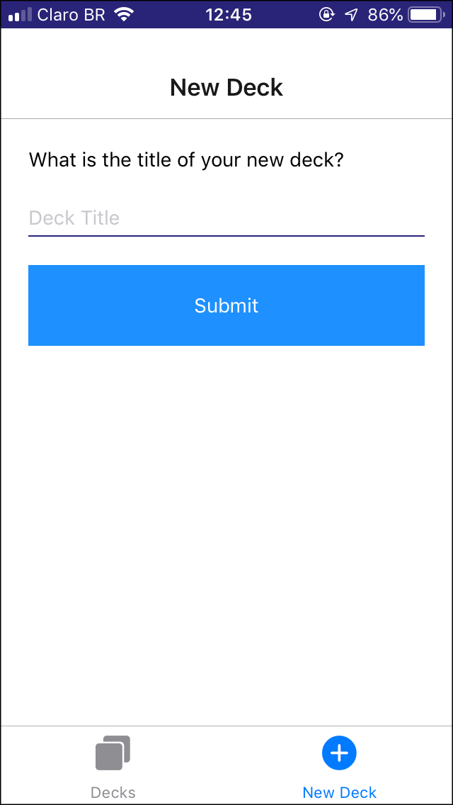

# Flashcards

Projeto Flashcards Móveis.

Aplicativo para dispositivos móveis (iOS) que permite aos usuários estudarem uma coleção de flashcards. Com o app, os usuários podem criar diferentes categorias de flashcards chamadas de "baralhos", adicionar flashcards a esses baralhos, e fazer os quizes nestes baralhos.

## Instalação e execução

```
yarn install
yarn start
```
   
ou   

```
npm install
npm start
```

## Compatibilidade

Testado apenas no iOS 12 

## Views

* **DecksScreen.js** - View da lista de baralhos
* **DeckScreen.js** - View de um baralho individual
* **QuizScreen.js** - View do Quiz
* **NewDeckScreen.js** - View do novo baralho
* **NewCardScreen.js** - View da nova pergunta

## Notificação push

Configurada para disparar uma vez por dia as 20 horas, caso o usuário não tenha estudado no dia, se o usuário acessar ao menos um quiz a notificação é adiada para o dia seguinte.

* **utils/notification.js** - Lib de notificação

## API e dados iniciais

Uma API carrega os dados iniciais da aplicação a partir do arquivo _utils/initial-data.js_ e persiste o estado da aplicação com _AsyncStorage_ fornecendo os métodos para manipulação dos dados persistidos. 

* **utils/api.js**  - API
 
## Telas

### Decks
  

### Deck
  

### Add Card
  

### Quiz 
  
  

### New Deck
 


  

